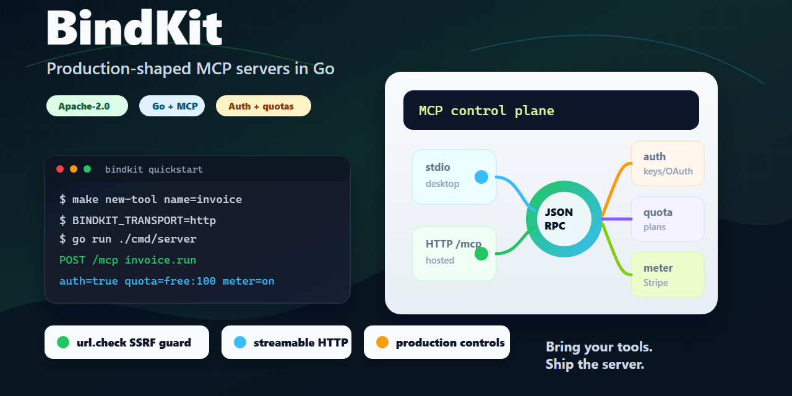

# BindKit

[](https://github.com/bindfort/bindkit/actions/workflows/ci.yml)
[](https://scorecard.dev/viewer/?uri=github.com/bindfort/bindkit)
[](LICENSE)



**Open-source Go starter kit for production-shaped MCP servers.**

BindKit wires the infrastructure most MCP server projects need before the first
real tool ships: JSON-RPC dispatch, stdio and HTTP transports, streamable HTTP,
API-key or OAuth bearer auth, metering, quotas, rate limits, Stripe usage
reporting, structured logging, Docker, and CI.

You bring the tools. BindKit gives you the server shape.

## Requirements

- Go 1.24 or newer;
- `curl` for the HTTP examples;
- Docker only if you want to build the container image.

The HTTP examples use two terminals: keep the server running in one terminal and
send MCP requests from another.

## Build your MCP server in 5 steps

1. Run BindKit:

```bash
BINDKIT_TRANSPORT=http go run ./cmd/server
```

On Windows PowerShell:

```powershell
.\run-local.ps1
```

2. List MCP tools:

```bash
curl -s http://127.0.0.1:8080/mcp -H 'content-type: application/json' \
  -d '{"jsonrpc":"2.0","id":1,"method":"tools/list"}'
```

You should see `url.check` and `weather.current`.

3. Scaffold your tool:

```bash
make new-tool name=invoice_lookup
# Windows:
pwsh scripts/new_tool.ps1 -Name invoice_lookup
```

4. Stop the server with `Ctrl+C`, then register the tool in `cmd/server/main.go`:

```go
invoice_lookup "github.com/bindfort/bindkit/tools/invoice_lookup"
```

```go
invoice_lookup.Register,
```

Then run `go test ./...`.

5. Restart it behind production controls:

```bash
BINDKIT_TRANSPORT=http BINDKIT_AUTH_ENABLED=true \
BINDKIT_API_KEYS=dev-key:free BINDKIT_BILLING_ENABLED=true \
BINDKIT_PLAN_QUOTAS=free:100 \
go run ./cmd/server
```

Full walkthrough: [docs/build-your-mcp-server.md](docs/build-your-mcp-server.md).

## Why this exists

MCP makes it easy to expose tools to agents. Production teams still need the
boring controls around those tools:

- who is allowed to call them;
- how often they can be called;
- how usage is metered;
- how plan quotas are enforced;
- how the server runs in CI, Docker, and hosted environments;
- how logs avoid leaking secrets.

BindKit is a compact reference implementation for that layer.

## What's in the box

| Concern | Implementation |
| --- | --- |
| MCP core | JSON-RPC dispatch, tool registry, `initialize`, `tools/list`, `tools/call` |
| Transports | stdio plus HTTP `/mcp`; streamable HTTP via SSE when `Accept: text/event-stream` is sent |
| Auth | static API keys or OAuth bearer tokens validated against JWKS |
| Billing hooks | plan quotas, in-memory usage store, Stripe meter-event reporting, webhook signature verification |
| Rate limiting | per-key token bucket with idle-bucket eviction |
| Metering | per-key counters; replace the `Store` interface for Redis or another backend |
| Config | typed environment config with fail-fast validation |
| Logging | `slog` JSON with a secret-redaction helper |
| Packaging | distroless Docker image, compose file, Fly config, GitHub Actions CI |
| Tools | `url.check` SSRF-guarded endpoint auditor plus `weather.current` demo |

## Try the bundled tools

Call the SSRF-guarded URL checker:

```bash
curl -s http://127.0.0.1:8080/mcp -H 'content-type: application/json' \
  -d '{"jsonrpc":"2.0","id":2,"method":"tools/call","params":{"name":"url.check","arguments":{"url":"https://example.com"}}}'
```

Expected result: a text report with the HTTP status code, latency, and security
headers present or missing.

Turn on auth, rate limits, and quotas:

```bash
BINDKIT_TRANSPORT=http BINDKIT_AUTH_ENABLED=true \
BINDKIT_API_KEYS=dev-key:pro BINDKIT_BILLING_ENABLED=true \
BINDKIT_PLAN_QUOTAS=free:100,pro:100000 \
go run ./cmd/server
```

## Production notes

Read:

- [docs/build-your-mcp-server.md](docs/build-your-mcp-server.md) for the first custom tool path;
- [docs/clients.md](docs/clients.md) for stdio and HTTP client usage;
- [docs/deploy.md](docs/deploy.md) for Docker, compose, and Fly;
- [docs/pricing.md](docs/pricing.md) for quota and billing hooks;
- [docs/testing.md](docs/testing.md) for test coverage;
- [docs/go-live.md](docs/go-live.md) for the release checklist.

Important environment variables:

```bash
BINDKIT_AUTH_MODE=oauth
BINDKIT_OAUTH_ISSUER=...
BINDKIT_OAUTH_JWKS_URL=...
BINDKIT_OAUTH_AUDIENCE=...
STRIPE_SECRET_KEY=sk_...
STRIPE_METER_EVENT=tool_call
STRIPE_WEBHOOK_SECRET=whsec_...
```

Build the image:

```bash
docker build -t bindkit .
```

## Layout

```text
cmd/server/        entrypoint + graceful shutdown
internal/
  auth/            static keys + OAuth bearer-token authenticators
  billing/         quota gate, Stripe meter reporter, webhook verification
  config/          typed env + validation
  logging/         slog redaction helper
  mcp/             JSON-RPC, registry, dispatcher
  metering/        counter Store
  ratelimit/       token bucket + eviction
  server/          stdio + HTTP transports, middleware chain
tools/             url_check real tool + example_weather demo
docs/              clients, pricing, deploy, testing, go-live
```

## Open-source status

BindKit is licensed under the [Apache License 2.0](LICENSE).

See:

- [NOTICE](NOTICE) for attribution and trademark notes;
- [THIRD_PARTY_NOTICES.md](THIRD_PARTY_NOTICES.md) for direct dependency notices;
- [CONTRIBUTING.md](CONTRIBUTING.md) for contribution rules;
- [SECURITY.md](SECURITY.md) for vulnerability reporting.

## What BindKit is not

BindKit is not a hosted platform, registry, or compliance product. It is a
starter kit and reference server for teams building their own MCP servers.
